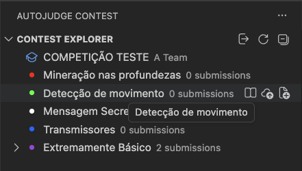
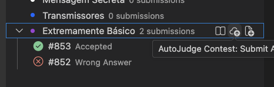
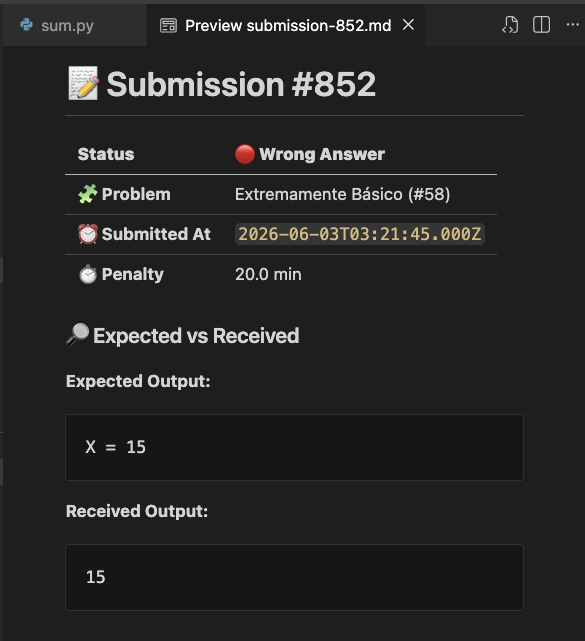

# AutoJudge Contest

<p align="center">
  
</p>

Participate in active AutoJudge contests, view problem descriptions, export public testcases, submit solutions, and track live standings directly inside Visual Studio Code.

---

## 🚀 Overview

The **AutoJudge Contest** extension allows competitive programming teams to focus on coding without context switching. It interfaces directly with the AutoJudge API from the [autojudge.io](https://autojudge.io) platform, offering a fully integrated environment to compete, submit, and succeed.

> [!TIP]
> **Perfect Pairing:** This extension works seamlessly alongside the [AutoJudge Code Runner](https://marketplace.visualstudio.com/items?itemName=autojudge.autojudge-extension) extension. Code, execute your code, and run tests cases, without ever leaving your editor.

---

## ✨ Features

- **🔐 Simple Team Authentication**
  Securely log in and out using your team credentials or hash. Your session is automatically saved and restored when VS Code restarts.

- **📖 Interactive Problem Browser**
  Read contest problems formatted in clean, readable Markdown directly inside VS Code. No web browser required.

  

- **🧪 Local Test Case Generation**
  Export public testcase input/output pairs (`.in` and `.out` files) next to your active source file for easy local debugging and validation.

- **⚡ Instant Submission & Poll-to-Verdict**
  Submit your active source code file with a single click or command. Supports `.c`, `.cpp`, `.java`, `.js`, `.php`, and `.py`. The extension polls for updates and alerts you as soon as the final verdict is landed.

  

- **📊 Real-time Standings & Team Insights**
  Monitor the competition with a live, score-sorted dashboard updated every 15 seconds. Click on any team to inspect their score and list of solved problems right inside the output channel.

- **🗂️ Submission History Tracking**
  Browse a history of all submissions for each problem, nested newest-first, and view detailed submission results immediately.


---

## 🛠️ Getting Started

Get ready for the contest in just a few quick steps:

1. **Open the Activity Bar:** Click the **AutoJudge Contest** icon on the VS Code sidebar.
2. **Log In:** Click **Login Team** or use the command palette. Enter your team ID or hash followed by the password.
3. **Explore Problems:** In the **Contest Explorer**, expand a problem. Use the book icon (📖) to view the problem description.
4. **Generate Testcases:** Export public cases beside your active source code file.
5. **Submit & Monitor:** Open your solution file, click the upload icon (📤), and monitor the verdict status live under the problem node or by clicking the submission row to view detailed outputs.

---

## 🌐 Custom & Self-Hosted Contests

Hosting your own contest? AutoJudge is completely open source. You can self-host your own AutoJudge contest server using the public repository:

👉 [**@werlang/autojudge**](https://github.com/werlang/autojudge)

To connect the extension to your self-hosted server, update the `baseUrl` configuration setting to map your custom API address (defaults to `https://api.autojudge.io`).

---

## ⚙️ Configuration Settings

Customize the extension's behavior via your VS Code Settings:

| Setting Key | Type | Default | Description |
| :--- | :--- | :--- | :--- |
| `autojudgeContest.baseUrl` | `string` | `"https://api.autojudge.io"` | Full base API URL of the AutoJudge server. Supports subpaths (e.g. `https://example.com/api`). |
| `autojudgeContest.pollIntervalMs` | `number` | `5000` | The polling interval (in milliseconds) used when waiting for a submission verdict. (Min: `1000`) |

*Note: The standings view automatically refreshes every 15 seconds (fixed interval).*

---

## ⌨️ Command Palette Contributions

All core functionality is easily accessible using the Command Palette (`Ctrl+Shift+P` or `Cmd+Shift+P`):

- **AutoJudge Contest: Login Team** (`autojudgeContest.loginTeam`) — Log in to the active contest.
- **AutoJudge Contest: Logout Team** (`autojudgeContest.logoutTeam`) — Logs out and clears active credentials.
- **AutoJudge Contest: Refresh Contest Tree** (`autojudgeContest.refreshTree`) — Refreshes problems, submissions, and standings manually.
- **AutoJudge Contest: Open Problem** (`autojudgeContest.openProblem`) — Opens the problem statement preview.
- **AutoJudge Contest: Submit Active File** (`autojudgeContest.submitActiveFile`) — Submits the active code file to the contest.
- **AutoJudge Contest: Export Public Cases** (`autojudgeContest.exportPublicCases`) — Exports public test cases to your folder.
- **AutoJudge Contest: Open Submission Result** (`autojudgeContest.openSubmission`) — Shows full details of the selected submission.
- **AutoJudge Contest: Open Team Standing** (`autojudgeContest.openTeamStanding`) — Displays detailed statistics for the selected team.

---

## 💻 Local Development & Contributions

To set up a local development environment for this extension:

1. Clone this repository.
2. Spin up the development environment container:
   ```bash
   docker compose up -d --build
   ```
3. Install dependencies inside the container:
   ```bash
   docker compose exec extension npm install
   ```
4. Launch the Extension Development Host by opening the project in VS Code and pressing `F5`.
5. Pack the extension locally:
   ```bash
   docker compose exec extension npm run build
   ```

---

## 📄 License

This extension is licensed under the [MIT License](LICENSE).
